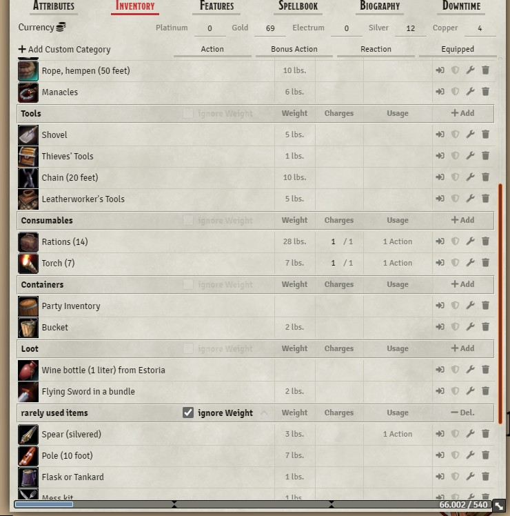

# inventory-plus

# Inventory+
A Foundry VTT module to enhance the dnd5e inventory. Allows to customize your Inventory in various ways.

## Installation
1. Copy this link and use it in Foundrys Module Manager to install the Module

    > https://raw.githubusercontent.com/syl3r86/inventory-plus/master/module.json
    
2. Enable the Module in your Worlds Module Settings

## Details
This module allows you to create custom inventory categorys and sort items into them and the default categorys. You can also order the categorys around and even disable weight tracking on a per category basis.

## Contribution
If you feel like supporting my work, feel free to leave a tip at my paypal felix.mueller.86@web.de

## License
 Inventory+ - a module for Foundry VTT - by <a xmlns:cc="http://creativecommons.org/ns#" href="https://github.com/syl3r86?tab=repositories" property="cc:attributionName" rel="cc:attributionURL">Felix Müller</a> is licensed under a <a rel="license" href="http://creativecommons.org/licenses/by/4.0/">Creative Commons Attribution 4.0 International License</a>.

This work is licensed under Foundry Virtual Tabletop [EULA - Limited License Agreement for module development v 0.3.8](https://foundryvtt.com/article/license/).
